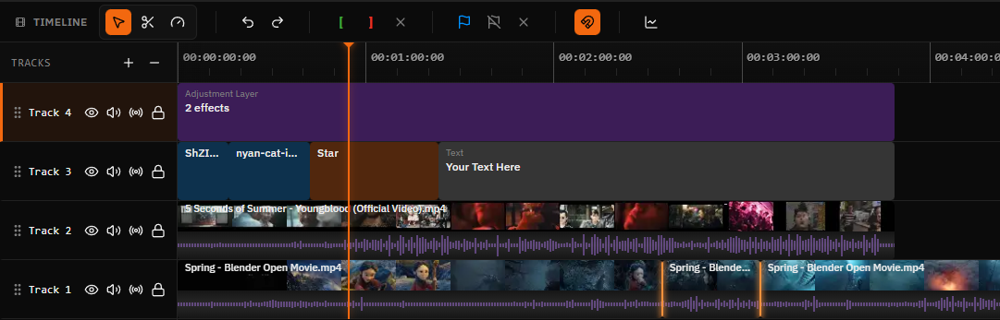

# FreeCut

**[freecut.net](http://freecut.net/)**

**Edit videos. In your browser.**

[](LICENSE)



FreeCut is a browser-based multi-track video editor. No installation, no uploads — everything runs locally in your browser using WebCodecs, OPFS, and the File System Access API.

## Features

### Timeline & Editing

- Multi-track timeline with video, audio, text, image, and shape tracks
- Track groups with mute/visible/locked propagation
- Trim, split, join, ripple delete, and rate stretch tools
- Per-track "Close Gaps" to remove empty space between clips, packing them left toward frame 0
- Filmstrip thumbnails and audio waveform visualization
- Pre-compositions (nested compositions, 1 level deep)
- Markers for organizing your edit
- Source monitor with mark in/out via playhead or skimmer and insert/overwrite edits
- Undo/redo with configurable history depth

### Effects & Animation

- **CSS filter effects** — brightness, contrast, saturation, blur, hue rotate, grayscale, sepia, invert
- **Glitch effects** — RGB split, scanlines, color glitch
- **Canvas effects** — halftone (dots, lines, rays, ripples)
- **Overlay effects** — vignette with configurable shape, softness, and color
- **Presets** — vintage, noir, cold, warm, dramatic, faded
- **Keyframe animation** — Bezier curve editor, easing functions (linear, ease-in/out, cubic-bezier, spring), auto-keyframe mode
- **Transitions** — fade, wipe, slide, 3D flip, clock wipe, iris — each with directional variants and adjustable duration/alignment

### Preview & Playback

- Real-time canvas preview with transform gizmo (drag, resize, rotate)
- Frame-accurate playback via custom Clock engine
- Snap guides and timecode display

### Export

- In-browser rendering via WebCodecs (no server required)
- **Video:** MP4, MOV, WebM, MKV
- **Audio-only:** MP3, AAC, WAV
- **Codecs:** H.264, H.265, VP8, VP9, ProRes (proxy through 4444 XQ)
- Quality presets: low, medium, high, ultra

### Media

- Import via File System Access API — files are referenced, never copied
- **Video:** MP4, WebM, MOV, MKV
- **Audio:** MP3, WAV, AAC, OGG, Opus
- **Image:** JPG, PNG, GIF (animated), WebP
- Up to 5 GB per file
- OPFS proxy video generation for smooth preview
- Media relinking for moved or deleted files

### Other

- Native SVG shapes — rectangle, circle, triangle, ellipse, star, polygon, heart
- Text overlays with custom fonts, colors, and positioning
- Project bundles — export/import projects as ZIP files with Zod-validated schemas
- IndexedDB persistence with content-addressable storage
- Auto-save
- Configurable settings (FPS, snap, waveforms, filmstrips, preview quality, export defaults, undo depth, auto-save interval)

## Quick Start

**Prerequisites:** Node.js 18+

```bash
git clone https://github.com/walterlow/freecut.git
cd freecut
npm install
npm run dev
```

Open [http://localhost:5173](http://localhost:5173) in Chrome.

### Workflow

1. Create a project from the projects page
2. Import media by dragging files into the media library
3. Drag clips to the timeline — trim, arrange, add effects and transitions
4. Animate with the keyframe editor
5. Preview your edit in real time
6. Export directly from the browser

## Browser Support

Chrome 102+ required. FreeCut uses WebCodecs, OPFS, and the File System Access API which are not yet available in all browsers.

### Brave

Brave disables the File System Access API by default. To enable it:

1. Navigate to `brave://flags/#file-system-access-api`
2. Change the setting from **Disabled** to **Enabled**
3. Click **Relaunch** to restart the browser

## Keyboard Shortcuts

| Action | Shortcut |
|---|---|
| Play / Pause | `Space` |
| Previous / Next frame | `Left` / `Right` |
| Go to start / end | `Home` / `End` |
| Split at playhead | `Alt+C` |
| Join clips | `J` |
| Delete selected | `Delete` |
| Ripple delete | `Ctrl+Delete` |
| Freeze frame | `Shift+F` |
| Undo / Redo | `Ctrl+Z` / `Ctrl+Y` |
| Copy / Cut / Paste | `Ctrl+C` / `Ctrl+X` / `Ctrl+V` |
| Selection tool | `V` |
| Razor tool | `C` |
| Rate stretch tool | `R` |
| Toggle snap | `S` |
| Add / Remove marker | `M` / `Shift+M` |
| Add keyframe | `K` |
| Toggle keyframe editor | `Ctrl+K` |
| Group / Ungroup tracks | `Ctrl+G` / `Ctrl+Shift+G` |
| Mark In / Out (playhead) | `I` / `O` |
| Mark In / Out (skimmer) | `Shift+I` / `Shift+O` |
| Insert / Overwrite edit | `,` / `.` |
| Save | `Ctrl+S` |
| Export | `Ctrl+E` |
| Zoom to fit | `Z` |

## Tech Stack

- [React 19](https://react.dev/) + [TypeScript](https://www.typescriptlang.org/)
- [Vite](https://vitejs.dev/) — build tool with HMR
- [Zustand](https://github.com/pmndrs/zustand) + [Zundo](https://github.com/charkour/zundo) — state management with undo/redo
- [TanStack Router](https://tanstack.com/router) — file-based type-safe routing
- [Tailwind CSS 4](https://tailwindcss.com/) + [shadcn/ui](https://ui.shadcn.com/) — styling and UI components
- [Mediabunny](https://mediabunny.dev/) — media decoding and metadata extraction
- Canvas + [WebCodecs](https://developer.mozilla.org/en-US/docs/Web/API/WebCodecs_API) — composition rendering and export
- [OPFS](https://developer.mozilla.org/en-US/docs/Web/API/File_System_API/Origin_private_file_system) + [IndexedDB](https://developer.mozilla.org/en-US/docs/Web/API/IndexedDB_API) — local persistence
- Web Workers — heavy processing off the main thread

## Development

```bash
npm run dev            # Dev server on port 5173
npm run build          # Production build
npm run lint           # ESLint
npm run check:boundaries # Feature boundary architecture check
npm run check:deps-contracts # Enforce deps contract seam routing
npm run check:legacy-lib-imports # Block any "@/lib/*" usage
npm run check:deps-wrapper-health # Fail on unused pass-through deps wrappers
npm run check:edge-budgets # Feature seam coupling budget check
npm run check:bundle-budgets # Build chunk size budget check
npm run report:feature-edges # Feature dependency edge report
npm run report:feature-edges:json # JSON feature edge report
npm run report:deps-wrapper-health:json # JSON deps wrapper health report
npm run verify         # Boundaries + deps contracts + no-lib guard + wrapper health + edge budgets + lint + build + bundle budgets
npm run test           # Vitest (watch mode)
npm run test:run       # Vitest (single run)
npm run test:coverage  # Vitest with coverage
npm run routes         # Regenerate TanStack Router route tree
```

### Environment

```env
VITE_SHOW_DEBUG_PANEL=true   # Show debug panel in dev (default: true)
```

### Project Structure

```text
src/
|- app/                     # App bootstrap and providers
|- domain/                  # Framework-agnostic domain logic
|- infrastructure/          # Browser/storage/worker adapters
|- features/
|  |- editor/                # Editor shell, toolbar, panels, stores
|  |- timeline/              # Multi-track timeline, actions, services
|  |- preview/               # Preview canvas, transform gizmo
|  |- player/                # Playback engine (Clock, composition)
|  |- composition-runtime/   # Composition rendering runtime (sequences/items/audio)
|  |- export/                # WebCodecs export pipeline (Web Worker)
|  |- effects/               # Visual effects (CSS filters, glitch, halftone, vignette)
|  |- keyframes/             # Keyframe animation, Bezier editor, easing
|  |- media-library/         # Media import, metadata, OPFS proxies
|  |- project-bundle/        # Project ZIP export/import
|  |- projects/              # Project management
|  \- settings/             # App settings
|- shared/                  # Shared UI/state/utilities across layers
|- components/ui/            # shadcn/ui components
|- config/hotkeys.ts         # Keyboard shortcut definitions
|- routes/                   # TanStack Router (file-based)
\- types/                    # Shared TypeScript types
```

Architecture boundary policy and migration plan: `docs/architecture-boundaries.md`

## Contributing

1. **Report bugs** — open an issue
2. **Suggest features** — start a discussion

## License

[MIT](LICENSE)

