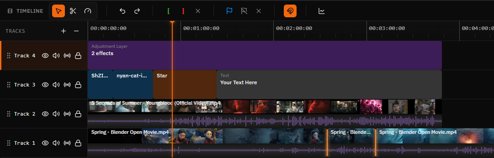

# FreeCut

**[freecut.net](http://freecut.net/)**

**Edit videos. In your browser.**

[](LICENSE)



FreeCut is a browser-based multi-track video editor. No installation, no uploads — everything runs locally in your browser using WebGPU, WebCodecs, and the File System Access API. Projects, media metadata, thumbnails, waveforms, and transcripts are written as plain files to a workspace folder you pick on disk.

## Features

### Timeline & Editing

- Multi-track timeline with video, audio, text, image, and shape tracks
- Track groups with mute/visible/locked propagation
- Trim, split, join, ripple delete, and rate stretch tools
- Rolling edit, ripple edit, slip, and slide tools
- Per-track "Close Gaps" to remove empty space between clips
- Filmstrip thumbnails and audio waveform visualization
- Pre-compositions (nested compositions, 1 level deep)
- Markers for organizing your edit
- Source monitor with mark in/out via playhead or skimmer and insert/overwrite edits
- Undo/redo with configurable history depth

### GPU Effects

All visual effects are WebGPU-accelerated.

- **Blur** — gaussian, box, motion, radial, zoom
- **Color** — brightness, contrast, exposure, hue shift, saturation, vibrance, temperature/tint, levels, curves, color wheels, grayscale, sepia, invert
- **Distortion** — pixelate, RGB split, twirl, wave, bulge/pinch, kaleidoscope, mirror, fluted glass
- **Stylize** — vignette, film grain, sharpen, posterize, glow, edge detect, scanlines, color glitch
- **Keying** — chroma key (green/blue screen) with tolerance, softness, and spill suppression

### Blend Modes

25 GPU-accelerated blend modes: normal, darken, multiply, color burn, linear burn, lighten, screen, color dodge, linear dodge, overlay, soft light, hard light, vivid light, linear light, pin light, hard mix, difference, exclusion, subtract, divide, hue, saturation, color, luminosity.

### Masks

Layer masks with keyframeable geometry transforms for compositing and selective effect application.

### Transitions

All transitions are WebGPU-accelerated with a Canvas 2D fallback for non-WebGPU environments.

- Fade, wipe, slide, 3D flip, clock wipe, iris — each with directional variants
- Dissolve, sparkles, glitch, light leak, pixelate, chromatic aberration, radial blur
- Adjustable duration and alignment

### Keyframe Animation

- Bezier curve editor with preset easing functions
- Easing: linear, ease-in, ease-out, ease-in-out, cubic-bezier, spring
- Auto-keyframe mode with dopesheet toggle
- Graph editor, dopesheet, and split view

### Preview & Playback

- Real-time WebGPU-composited preview with transform gizmo (drag, resize, rotate)
- Frame-accurate playback via custom Clock engine
- GPU scopes — waveform, vectorscope, histogram
- Snap guides and timecode display

### Export

- In-browser rendering via WebCodecs (no server required)
- **Video containers:** MP4, WebM, MOV, MKV
- **Video codecs:** H.264, H.265, VP8, VP9, AV1
- **Audio export formats:** MP3, AAC, WAV (PCM)
- Quality presets: low (2 Mbps), medium (5 Mbps), high (10 Mbps), ultra (20 Mbps)

### Media

- Import via File System Access API — files are referenced, never copied
- **Video:** MP4, WebM, MOV, MKV
- **Audio:** MP3, WAV, AAC, OGG, Opus
- **Image:** JPG, PNG, GIF (animated), WebP
- Up to 5 GB per file
- Proxy video generation for smooth preview (cached to the workspace folder)
- Media relinking for moved or deleted files
- Scene detection and optical flow analysis

### Transcription

- Browser-based speech-to-text via Whisper (runs locally in a Web Worker)
- Models: Tiny, Base, Small, Large v3 Turbo
- Auto-generate caption text items from transcripts
- Multi-language support

### Text-to-Speech

- In-browser voiceover generation via KittenTTS (WebGPU)
- Adds the generated audio clip directly to the timeline

### Other

- Native SVG shapes — rectangle, circle, triangle, ellipse, star, polygon, heart
- Text overlays with custom fonts, colors, and positioning
- Project bundles — export/import projects as ZIP files with Zod-validated schemas
- Workspace folder persistence via File System Access API — your projects live as plain files on disk, not locked away in browser storage
- Auto-save
- Customizable keyboard shortcuts with preset import/export
- Configurable settings (default FPS, snap, waveforms, filmstrips, preview quality, export defaults, undo depth, auto-save interval)

## Quick Start

**Prerequisites:** Node.js 20+

```bash
git clone https://github.com/walterlow/freecut.git
cd freecut
npm install
npm run dev
```

Open [http://localhost:5173](http://localhost:5173) in Chrome.

### Workflow

1. Pick a workspace folder when prompted — FreeCut writes all projects, media metadata, and caches into this folder
2. Create a project from the projects page
3. Import media by dragging files into the media library
4. Drag clips to the timeline — trim, arrange, add effects and transitions
5. Animate with the keyframe editor
6. Preview your edit in real time
7. Export directly from the browser

## Browser Support

Chrome or Edge 113+ recommended. FreeCut uses WebGPU, WebCodecs, OPFS, and the File System Access API, so a modern Chromium browser is required for the full workflow.

### Brave

Brave disables the File System Access API by default. To enable it:

1. Navigate to `brave://flags/#file-system-access-api`
2. Change the setting from **Disabled** to **Enabled**
3. Click **Relaunch** to restart the browser

## Keyboard Shortcuts

| Action | Shortcut |
|---|---|
| Play / Pause | `Space` |
| Previous / Next frame | `Left` / `Right` |
| Previous / Next snap point | `Up` / `Down` |
| Go to start / end | `Home` / `End` |
| Split at playhead | `Ctrl+K` / `Alt+C` |
| Split at cursor | `Shift+C` |
| Join clips | `Shift+J` |
| Delete selected | `Delete` |
| Ripple delete | `Ctrl+Delete` |
| Freeze frame | `Shift+F` |
| Nudge item (1px / 10px) | `Shift+Arrow` / `Ctrl+Shift+Arrow` |
| Undo / Redo | `Ctrl+Z` / `Ctrl+Shift+Z` |
| Copy / Cut / Paste | `Ctrl+C` / `Ctrl+X` / `Ctrl+V` |
| Selection tool | `V` |
| Razor tool | `C` |
| Rate stretch tool | `R` |
| Rolling edit tool | `N` |
| Ripple edit tool | `B` |
| Slip tool | `Y` |
| Slide tool | `U` |
| Toggle snap | `S` |
| Add / Remove marker | `M` / `Shift+M` |
| Previous / Next marker | `[` / `]` |
| Add keyframe | `A` |
| Clear keyframes | `Shift+A` |
| Toggle keyframe editor | `Ctrl+Shift+A` |
| Keyframe view: graph / dopesheet / split | `1` / `2` / `3` |
| Group / Ungroup tracks | `Ctrl+G` / `Ctrl+Shift+G` |
| Mark In / Out | `I` / `O` |
| Clear In/Out | `Alt+X` |
| Insert / Overwrite edit | `,` / `.` |
| Zoom in / out | `Ctrl+=` / `Ctrl+-` |
| Zoom to fit | `\` |
| Zoom to 100% | `Shift+\` |
| Save | `Ctrl+S` |
| Export | `Ctrl+Shift+E` |

## Tech Stack

- [React 19](https://react.dev/) + [TypeScript](https://www.typescriptlang.org/)
- [Vite](https://vitejs.dev/) — build tool with HMR
- [WebGPU](https://developer.mozilla.org/en-US/docs/Web/API/WebGPU_API) — GPU-accelerated effects, compositing, and scopes
- [Zustand](https://github.com/pmndrs/zustand) + [Zundo](https://github.com/charkour/zundo) — state management with undo/redo
- [TanStack Router](https://tanstack.com/router) — file-based type-safe routing
- [Tailwind CSS 4](https://tailwindcss.com/) + [shadcn/ui](https://ui.shadcn.com/) — styling and UI components
- [Mediabunny](https://mediabunny.dev/) — media decoding and metadata extraction
- [WebCodecs](https://developer.mozilla.org/en-US/docs/Web/API/WebCodecs_API) — composition rendering and export
- [File System Access API](https://developer.mozilla.org/en-US/docs/Web/API/File_System_API) — workspace folder persistence
- [Transformers.js](https://huggingface.co/docs/transformers.js) — in-browser Whisper transcription
- [KittenTTS](https://github.com/KittenML/kitten-tts-webgpu) — WebGPU text-to-speech
- Web Workers — heavy processing off the main thread

## Development

```bash
npm run dev            # Dev server on port 5173
npm run dev:quiet      # Dev server with perf-focused env (hides debug panel)
npm run dev:compare    # Run dev and local perf preview together
npm run build          # Production build
npm run build:perf     # Production build using `.env.perf`
npm run lint           # ESLint
npm run check:boundaries # Feature boundary architecture check
npm run check:deps-contracts # Enforce deps contract seam routing
npm run check:legacy-lib-imports # Block any "@/lib/*" usage
npm run check:deps-wrapper-health # Fail on unused pass-through deps wrappers
npm run check:edge-budgets # Feature seam coupling budget check
npm run report:feature-edges # Feature dependency edge report
npm run report:feature-edges:json # JSON feature edge report
npm run report:deps-wrapper-health:json # JSON deps wrapper health report
npm run verify         # Boundaries + deps contracts + no-lib guard + wrapper health + edge budgets + lint + tests + build
npm run preview:perf   # Serve the last production build on port 4173
npm run perf           # Build + serve a local production-like perf target
npm run test           # Vitest (watch mode)
npm run test:run       # Vitest (single run)
npm run test:coverage  # Vitest with coverage
npm run routes         # Regenerate TanStack Router route tree
```

### Performance Checks

- `npm run dev` is best for correctness and iteration, but it includes React/Vite dev overhead, HMR, and repo debug instrumentation.
- `npm run perf` is the better check for "is this a real playback issue or just dev noise?" because it serves a production build locally.
- `npm run dev:quiet` is a lighter dev workflow when you still need HMR but want the editor debug panel hidden.
- `npm run dev:compare` starts both `http://localhost:5173` and `http://localhost:4173` together so you can compare dev vs local production-like behavior side by side.

### Environment

```env
VITE_SHOW_DEBUG_PANEL=true   # Show debug panel in dev (default: true)
```

### Project Structure

```text
src/
|- app/                     # App bootstrap and providers
|- domain/                  # Framework-agnostic domain logic
|  |- animation/             # Easing functions and interpolation
|  |- projects/              # Project domain types
|  \- timeline/              # Transitions (engine, registry, renderers)
|- infrastructure/          # Browser/storage/GPU adapters (workspace-fs, handles-db, gpu facades)
|- lib/
|  |- gpu-effects/           # WebGPU effect pipeline + shader definitions
|  |- gpu-transitions/       # WebGPU transition pipeline + shaders
|  |- gpu-compositor/        # WebGPU blend mode compositor
|  |- gpu-scopes/            # WebGPU waveform/vectorscope/histogram
|  |- masks/                 # Mask texture management
|  |- analysis/              # Optical flow and scene detection
|  |- thumbnails/            # GPU-accelerated thumbnail renderer
|  |- fonts/                 # Font loading
|  |- shapes/                # Shape path generators
|  \- migrations/            # Data migration system
|- features/
|  |- editor/                # Editor shell, toolbar, panels, stores
|  |- timeline/              # Multi-track timeline, actions, services
|  |- preview/               # Preview canvas, transform gizmo, GPU scopes
|  |- player/                # Playback engine (Clock, composition)
|  |- composition-runtime/   # Composition rendering (sequences/items/audio/transitions)
|  |- export/                # WebCodecs export pipeline (Web Worker)
|  |- effects/               # GPU effect system and UI panels
|  |- keyframes/             # Keyframe animation, Bezier editor, easing
|  |- media-library/         # Media import, metadata, proxy cache, transcription, TTS
|  |- project-bundle/        # Project ZIP export/import
|  |- projects/              # Project management
|  |- settings/              # App settings, keyboard shortcut editor
|  \- workspace-gate/        # Workspace folder picker / permission gate
|- shared/                  # Shared UI/state/utilities across layers
|- components/ui/            # shadcn/ui components
|- config/hotkeys.ts         # Keyboard shortcut definitions
|- routes/                   # TanStack Router (file-based)
\- types/                    # Shared TypeScript types
```

Architecture boundary policy and migration plan: `docs/architecture-boundaries.md`

## Contributing

FreeCut is open source but not open contribution — pull requests are not accepted at this time.

- **Report bugs** — open an issue
- **Suggest features** — start a discussion

## License

[MIT](LICENSE)
